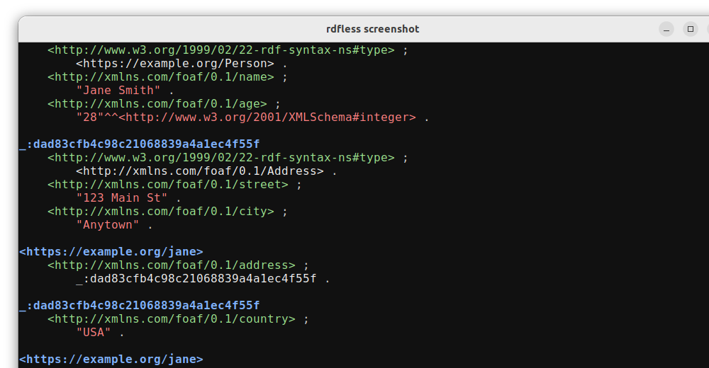

# rdfless

[](https://github.com/larsw/rdfless/actions/workflows/ci.yml)
[](https://crates.io/crates/rdfless)
[](https://github.com/larsw/rdfless/blob/main/LICENSE)

A colorful pretty printer for RDF data with ANSI colors.

## Description

`rdfless` is a command-line tool that reads RDF data in various formats (Turtle, TriG, N-Triples, N-Quads) and pretty-prints it with syntax highlighting. It's designed to make RDF data more readable in terminal environments.

Key features:
- Colorized output for different RDF components (subjects, predicates, objects, literals)
- Support for reading from files or stdin (piped input)
- Option to expand prefixes or display PREFIX declarations
- Customizable colors through a configuration file

### Supported Formats

- Turtle / Turtle-*
- TriG / TriG-*
- N-Triples (NT)
- N-Quads (NQ)

## Installation

### Debian/Ubuntu from PPA

```bash
sudo add-apt-repository ppa:larsw/rdfless
sudo apt update
sudo apt install rdfless
```

### Using Cargo

```bash
cargo install rdfless
```

### From Source

```bash
git clone https://github.com/larsw/rdfless.git
cd rdfless
cargo build --release
```

The binary will be available at `target/release/rdfless`.

#### Build Optimizations

Release builds automatically include the following optimizations:

- Debug symbols are stripped from the binary to reduce file size
- If [UPX](https://upx.github.io/) is available on your system path, the binary will be compressed for even smaller file size

These optimizations help create a more compact executable without affecting functionality.

## Usage

```bash
# Process a TTL file
rdfless file.ttl

# Process a TriG file
rdfless file.trig

# Process an N-Triples file
rdfless file.nt

# Process an N-Quads file
rdfless file.nq

# Process multiple files
rdfless file1.ttl file2.trig file3.nt file4.nq

# Read from stdin
cat file.ttl | rdfless

# Expand prefixes instead of showing PREFIX declarations
rdfless --expand file.ttl

# Override the input format (auto-detected from file extension by default)
rdfless --format turtle file.rdf
rdfless --format trig file.rdf
rdfless --format ntriples file.rdf
rdfless --format nquads file.rdf
```

## Configuration

`rdfless` uses a TOML configuration file to customize colors. The configuration file is located at:

```
~/.local/rdfless/config.toml
```

If the file doesn't exist, a default configuration will be created automatically.

Example configuration:

```toml
[colors]
subject = "blue"
predicate = "green"
object = "white"
literal = "red"
prefix = "yellow"
base = "yellow"
graph = "yellow"

[output]
expand = false
```

Available colors:
- Named colors: black, red, green, yellow, blue, magenta, cyan, white
- Bright named colors: bright_black, bright_red, bright_green, bright_yellow, bright_blue, bright_magenta, bright_cyan, bright_white
- CSS color codes: Any valid hex color code in the format #RRGGBB or #RGB (e.g., #336699 or #369)

Example configuration with CSS color codes:

```toml
[colors]
subject = "#336699"
predicate = "#00cc00"
object = "#ffffff"
literal = "#ff0000"
prefix = "#ffcc00"
base = "#ffcc00"
graph = "#ffcc00"

[output]
expand = false
```

## Example

Input:
```turtle
@prefix rdf: <http://www.w3.org/1999/02/22-rdf-syntax-ns#> .
@prefix rdfs: <http://www.w3.org/2000/01/rdf-schema#> .
@prefix ex: <https://example.org/> .

ex:Person a rdfs:Class ;
    rdfs:label "Person" .

ex:john a ex:Person ;
    rdfs:label "John Doe" .
```

Output will be the same content but with syntax highlighting for better readability.

## Screenshots

### Turtle Format (TTL)

Compact Mode | Expanded Mode
:----------:|:------------:
 | 

### TriG Format (TRIG)

Compact Mode | Expanded Mode
:----------:|:------------:
 | 

## License

This project is licensed under the BSD-3-Clause License - see the LICENSE file for details.

## Author

Lars Wilhelmsen <lars@lars-backwards.org>
