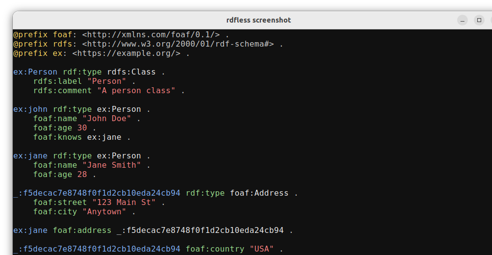
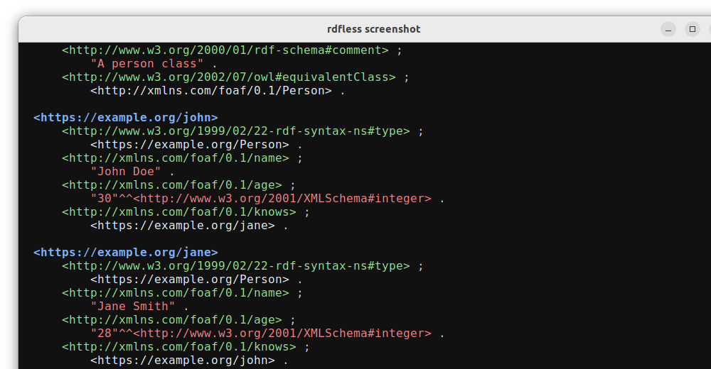
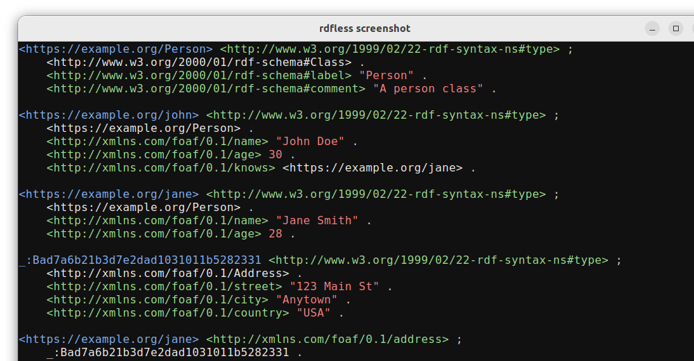
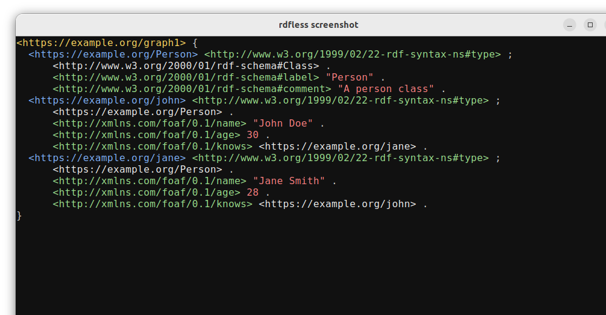

# rdfless

[](https://github.com/larsw/rdfless/actions/workflows/ci.yml)
[](https://crates.io/crates/rdfless)
[](https://github.com/larsw/rdfless/blob/main/LICENSE)

A colorful pretty printer for RDF data with ANSI colors.

## Description

`rdfless` is a command-line tool that reads RDF data in Turtle, TriG, N-Triples, N-Quads, and PROV-N formats and pretty-prints it with syntax highlighting. It's designed to make RDF data more readable in terminal environments. RDF 1.2 for Turtle and TriG is supported, including quoted triples, triple terms, annotation syntax (`~` with `{| |}`), and VERSION/@version directives.

Key features:
- Colorized output for different RDF components (subjects, predicates, objects, literals)
- Multiple themes
- Intelligent theme switching based on background color (dark/light)
- Support for reading from files or stdin (piped input)
- Option to expand prefixes or display PREFIX declarations
- Customizable colors through a configuration file
- Pager (minus-based) enabling scrolling up/down in content
- Robust error handling with continue-on-error option
- Flexible filtering by subject, predicate, or object

### Usage

```
Usage: rdfless [OPTIONS] [FILE]...

Arguments:
  [FILE]...  Input files (Turtle, TriG, N-Triples, N-Quads, or PROV-N format)

Options:
      --expand                   Expand prefixes instead of showing PREFIX declarations
      --compact                  Compact mode (opposite of 'expand')
      --format <FORMAT>          Override the input format (auto-detected from file extension by default) Supported formats: turtle, trig, ntriples, nquads, provn [possible values: turtle, trig, ntriples, nquads, provn]
      --pager                    Enable paging for large outputs
      --no-pager                 Disable paging (useful when paging is enabled by default in config)
      --dark-theme               Force dark theme colors
      --light-theme              Force light theme colors
      --no-auto-theme            Disable automatic background detection
      --continue-on-error        Continue parsing even when encountering errors (skip invalid triples)
  -s, --subject <SUBJECT>        Filter by subject (IRI or prefixed name)
  -p, --predicate <PREDICATE>    Filter by predicate (IRI or prefixed name)
  -o, --object <OBJECT>          Filter by object (IRI, prefixed name, or literal value)
  -O, --output <OUTPUT>          Output file (write to file instead of stdout)
      --completion <COMPLETION>  Generate shell completion script for bash, zsh, fish, elvish, or powershell [possible values: bash, elvish, fish, powershell, zsh]
  -h, --help                     Print help
  -V, --version                  Print version
```

### Supported Formats

- Turtle / RDF 1.2 (quoted triples)
- TriG / RDF 1.2 (quoted triples)
- N-Triples (NT)
- N-Quads (NQ)
- PROV-N (Provenance Notation)

## Installation

### Quick Install (Linux)

Install the latest version with a single command:

```bash
curl -sSL https://raw.githubusercontent.com/larsw/rdfless/main/install.sh | bash
```

This will download and install the latest Linux binary to `~/.local/bin` and optionally add it to your PATH.

### Manual Download

Download the latest release for your platform from the [GitHub Releases](https://github.com/larsw/rdfless/releases/latest) page:

- **Linux**: `rdfless-VERSION-linux-x86_64`
- **Windows**: `rdfless-VERSION-windows-x86_64.exe`  
- **macOS**: `rdfless-VERSION-macos-x86_64`
- **Debian/Ubuntu**: `rdfless_VERSION_amd64.deb`

#### Verifying Release Integrity

All release artifacts include SLSA Build Level 3 provenance and SHA256 checksums for verification:

1. **SHA256 Verification**: Each release includes a `checksums.txt` file with SHA256 hashes for all artifacts:
   ```bash
   # Download your binary and the checksums file, then verify:
   sha256sum -c checksums.txt
   ```

2. **SLSA Provenance Verification**: All artifacts include SLSA provenance that can be verified using the [slsa-verifier](https://github.com/slsa-framework/slsa-verifier) tool:
   ```bash
   # Install slsa-verifier
   go install github.com/slsa-framework/slsa-verifier/v2/cli/slsa-verifier@latest
   
   # Verify a binary (example for Linux)
   slsa-verifier verify-artifact \
     --provenance-path rdfless-VERSION-linux-x86_64.intoto.jsonl \
     --source-uri github.com/larsw/rdfless \
     rdfless-VERSION-linux-x86_64
   ```

This ensures that the binaries you download were built by the official GitHub Actions workflow and haven't been tampered with.

### Using Cargo

```bash
cargo install rdfless
```

### From Source

```bash
git clone https://github.com/larsw/rdfless.git
cd rdfless
cargo build --release
```

The binary will be available at `target/release/rdfless`.

#### Using Just

For a complete development workflow with formatting, linting, testing, and building:

```bash
# Install Just: https://github.com/casey/just
cargo install just

# Build release version
just build

# Development workflow (format, lint, test, build)
just dev

# Install system-wide (requires sudo)
sudo just install

# Build distribution binaries for all platforms
just dist

# See all available commands
just list
```

#### Build Optimizations

Release builds automatically include the following optimizations:

- Debug symbols are stripped from the binary to reduce file size
- If [UPX](https://upx.github.io/) is available on your system path, the binary will be compressed for even smaller file size

These optimizations help create a more compact executable without affecting functionality.

## Shell Completion

`rdfless` supports shell completion for bash, zsh, fish, elvish, and PowerShell. You can generate completion scripts using the `--completion` flag:

### Bash

```bash
# Generate completion script
rdfless --completion bash > ~/.local/share/bash-completion/completions/rdfless

# Or for system-wide installation (requires sudo)
sudo rdfless --completion bash > /etc/bash_completion.d/rdfless
```

### Zsh

```bash
# Generate completion script (make sure ~/.zfunc is in your fpath)
mkdir -p ~/.zfunc
rdfless --completion zsh > ~/.zfunc/_rdfless

# Add to ~/.zshrc if not already present:
# fpath=(~/.zfunc $fpath)
# autoload -U compinit && compinit
```

### Fish

```bash
# Generate completion script
rdfless --completion fish > ~/.config/fish/completions/rdfless.fish
```

### Other Shells

```bash
# Generate for elvish
rdfless --completion elvish

# Generate for PowerShell  
rdfless --completion powershell
```

After installing completions, restart your shell or source the appropriate configuration file.

## Usage

```bash
# Process a TTL file
rdfless file.ttl

# Process a TriG file
rdfless file.trig

# Process an N-Triples file
rdfless file.nt

# Process an N-Quads file
rdfless file.nq

# Process a PROV-N file
rdfless file.provn

# Process multiple files
rdfless file1.ttl file2.trig file3.nt file4.nq file5.provn

# Read from stdin
cat file.ttl | rdfless

# Expand prefixes instead of showing PREFIX declarations
rdfless --expand file.ttl

# Override the input format (auto-detected from file extension by default)
rdfless --format turtle file.rdf
rdfless --format trig file.rdf
rdfless --format ntriples file.rdf
rdfless --format nquads file.rdf
rdfless --format provn file.rdf

# Continue parsing even if there are errors in the RDF file
rdfless --continue-on-error malformed_file.ttl

# Filter RDF triples by subject
rdfless --filter-subject "ex:john" file.ttl
rdfless --filter-subject "http://example.org/person1" file.ttl

# Filter RDF triples by predicate
rdfless --filter-predicate "foaf:name" file.ttl
rdfless --filter-predicate "http://xmlns.com/foaf/0.1/name" file.ttl

# Filter RDF triples by object (IRI, prefixed name, or literal)
rdfless --filter-object "ex:Person" file.ttl
rdfless --filter-object "John Doe" file.ttl
rdfless --filter-object "http://example.org/Person" file.ttl

# Combine filtering with other options
rdfless --expand --filter-subject "ex:john" --no-pager file.ttl
```

## Configuration

`rdfless` uses a TOML configuration file to customize colors. The configuration file is located at:

```
~/.local/rdfless/config.toml
```

If the file doesn't exist, a default configuration will be created automatically.

Example configuration:

```toml
[colors]
subject = "blue"
predicate = "green"
object = "white"
literal = "red"
prefix = "yellow"
base = "yellow"
graph = "yellow"

[output]
expand = false
```

Available colors:
- Named colors: black, red, green, yellow, blue, magenta, cyan, white
- Bright named colors: bright_black, bright_red, bright_green, bright_yellow, bright_blue, bright_magenta, bright_cyan, bright_white
- CSS color codes: Any valid hex color code in the format #RRGGBB or #RGB (e.g., #336699 or #369)

Example configuration with CSS color codes:

```toml
[colors]
subject = "#336699"
predicate = "#00cc00"
object = "#ffffff"
literal = "#ff0000"
prefix = "#ffcc00"
base = "#ffcc00"
graph = "#ffcc00"

[output]
expand = false
```

## Pager Keybindings

When paging is enabled (either through the `--pager` flag or configuration), `rdfless` uses the `minus` pager which provides powerful navigation and search capabilities. For a complete list of available keybindings and shortcuts, see [PAGER_KEYBINDINGS.md](PAGER_KEYBINDINGS.md).

Key highlights:
- **Ctrl+C/q**: Quit the pager
- **Arrow keys/j/k**: Scroll up/down line by line
- **Page Up/Down**: Scroll by full pages
- **g/G**: Go to top/bottom
- **/ and ?**: Forward and backward search
- **n/p**: Navigate between search matches

## Example

Input:

```turtle
@prefix rdf: <http://www.w3.org/1999/02/22-rdf-syntax-ns#> .
@prefix rdfs: <http://www.w3.org/2000/01/rdf-schema#> .
@prefix ex: <https://example.org/> .

ex:Person a rdfs:Class ;
    rdfs:label "Person" .

ex:john a ex:Person ;
    rdfs:label "John Doe" .
```

Output will be the same content but with syntax highlighting for better readability.

## Screenshots

### Turtle Format (TTL)

Compact Mode | Expanded Mode
:----------:|:------------:
 | 

### TriG Format (TRIG)

Compact Mode | Expanded Mode
:----------:|:------------:
 | 

### N-Triples (NT)



### N-Quads (NQ)



For how to regenerate these screenshots, see the Contributors guide.

## License

This project is licensed under the BSD-3-Clause License - see the LICENSE file for details.

## Author

Lars Wilhelmsen <lars@lars-backwards.org>
